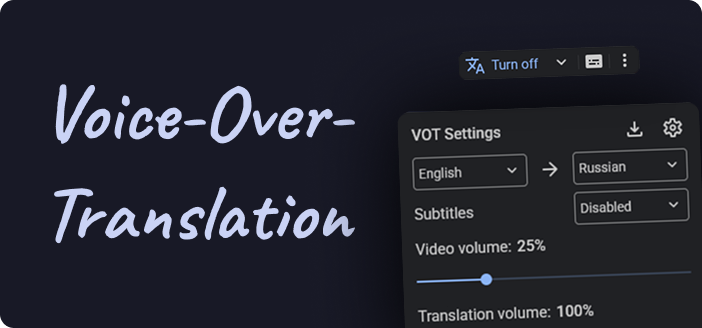

<!-- loaders links (website > github > store) -->

[tampermonkey-link]: https://www.tampermonkey.net/index.php
[violentmonkey-opera]: https://chrome.google.com/webstore/detail/violent-monkey/jinjaccalgkegednnccohejagnlnfdag
[violentmonkey-link]: https://violentmonkey.github.io

<!-- FAQs / Wiki -->

[devmode-enable]: https://www.tampermonkey.net/faq.php#Q209
[opera-search-results-access]: https://help.opera.com/en/extensions/content-scripts/
[vot-faq]: https://github.com/ilyhalight/voice-over-translation/wiki/%5BRU%5D-FAQ
[vot-supported-sites]: https://github.com/ilyhalight/voice-over-translation/wiki/%5BRU%5D-Supported-sites
[vot-wiki]: https://github.com/ilyhalight/voice-over-translation/wiki

<!-- Our servers -->

[vot-balancer]: https://vot-worker.toil.cc/health
[vot-worker]: https://github.com/FOSWLY/vot-worker
[media-proxy]: https://github.com/FOSWLY/media-proxy
[vot-backend]: https://github.com/FOSWLY/vot-backend
[vot-status]: https://votstatus.toil.cc
[vot-stats]: https://votstats.toil.cc

<!-- Install / Build -->

[vot-dist]: https://raw.githubusercontent.com/ilyhalight/voice-over-translation/master/dist/vot.user.js
[vot-releases]: https://github.com/ilyhalight/voice-over-translation/releases
[nodejs-link]: https://nodejs.org
[bun-link]: https://bun.sh/

<!-- Badges -->

[badge-en]: https://img.shields.io/badge/lang-English%20%F0%9F%87%AC%F0%9F%87%A7-white
[badge-ru]: https://img.shields.io/badge/%D1%8F%D0%B7%D1%8B%D0%BA-%D0%A0%D1%83%D1%81%D1%81%D0%BA%D0%B8%D0%B9%20%F0%9F%87%B7%F0%9F%87%BA-white

<!-- Stores -->

[vot-chrome-store]: https://chromewebstore.google.com/detail/dnioaagdjgpcokckfpokpndoblenmfcg
[vot-firefox-store]: https://addons.mozilla.org/ru/firefox/addon/voice-over-translation/

<!-- Other -->

[vot-readme-ru]: README.md
[vot-readme-en]: README-EN.md
[vot-langs]: LANG_SUPPORT.md
[vot-issues]: https://github.com/ilyhalight/voice-over-translation/issues
[votjs-link]: https://github.com/FOSWLY/vot.js
[vot-cli-link]: https://github.com/FOSWLY/vot-cli
[yabrowser-link]: https://yandex.ru/project/browser/streams/technology
[yatranslate-link]: https://translate.yandex.ru/
[contributors-link]: https://github.com/ilyhalight/voice-over-translation/graphs/contributors

<!-- Content -->

<div align="center">
  <h1>voice-over-translation (<code>vot</code>)</h1>
  <p>Смотрите видео на другом языке с закадровым переводом и субтитрами в <a href="./BROWSERS-EXTS-TEST.md">любом браузере</a></p>

  [Установка](#установка-расширения) ·
  [Разработка](#как-собрать-расширение) ·
  [FAQ][vot-faq] ·
  [Поддерживаемые сайты][vot-supported-sites]

  [![en][badge-en]][vot-readme-en]
  [![ru][badge-ru]][vot-readme-ru]

  
</div>

---

> Все права на оригинальное программное обеспечение принадлежат их правообладателям. Расширение не связано с оригинальными правообладателями.

Большое спасибо разработчикам **[Yandex.Translate][yatranslate-link]**, **[Yandex.Browser][yabrowser-link]** и всем, [кто помогает делать расширение][contributors-link] еще лучше.

## Установка расширения

> [!CAUTION]
> Перед созданием Issues настоятельно рекомендуем ознакомиться с разделом [FAQ][vot-faq] и уже существующими [Issues][vot-issues].

> [!WARNING]
> **Важно для пользователей Tampermonkey 5.2+ (MV3):**
> В браузерах на движке **Chromium** (Chrome, Edge, Brave, Vivaldi и др.) необходимо:
> 1. Открыть страницу расширений (`chrome://extensions`) и включить **«Режим разработчика»** (подробности в [документации Tampermonkey][devmode-enable]).
> 2. Если движок **Chromium версии 138+**, в «Сведениях» расширения включить **«Разрешить пользовательские скрипты»**.
>
> **Пользователям Opera:**
> 1. Используйте **[Violentmonkey][violentmonkey-opera]** вместо Tampermonkey.
> 2. В настройках расширения обязательно включите **«Разрешить доступ к результатам на странице поиска»** (гайд от Opera: [как найти эту настройку][opera-search-results-access]), иначе скрипт не будет работать.

1. Установите загрузчик юзерскриптов: **[Tampermonkey][tampermonkey-link]** (или [Violentmonkey][violentmonkey-opera] для Opera)
2. **[«Установить скрипт»][vot-dist]**

### Установка нативного расширения для Chrome / Chromium

#### Из Chrome WebStore

Откройте [Chrome WebStore][vot-chrome-store] и нажмите «Установить»

#### Из GitHub Releases

2. Откройте [Releases][vot-releases] и скачайте файл `vot-extension-chrome-<версия>.zip`
3. Откройте страницу расширений:
   - Chrome: `chrome://extensions`
   - Edge: `edge://extensions`
   - Brave: `brave://extensions`
   - Opera: `opera://extensions`
4. Включите **«Режим разработчика»**
5. Перетащите скачанный `.zip`-файл на страницу расширений

### Установка нативного расширения для Firefox

#### Из Firefox Add-ons

Откройте [Firefox Add-ons][vot-firefox-store] и нажмите «Добавить в Firefox»

#### Из GitHub Releases

Откройте [Releases][vot-releases], нажмите на `vot-extension-firefox-<версия>.xpi` и подтвердите установку в Firefox

## Возможности

- Перевод видео на русский, английский или казахский с [поддерживаемых языков][vot-langs]
- Автоматический перевод видео при открытии
- Автоматическое включение субтитров при открытии
- Умное расположение субтитров: адаптация длины строк и размера текста под размер плеера
- Отображение субтитров, сгенерированных нейросетью
- Отображение субтитров с сайта (например, автопереведенные субтитры YouTube)
- Сохранение субтитров в форматах `.srt`, `.vtt`, `.json`
- Сохранение аудиодорожки перевода в формате `.mp3`
- Отдельные ползунки громкости для оригинального и переведённого звука
- Адаптивная громкость: приглушение оригинала, когда звучит перевод
- Синхронизация громкости перевода с громкостью видео
- Ограничение перевода с выбранных языков (можно выбрать в меню)
- Горячие клавиши для перевода и управления субтитрами (включая комбинации клавиш)
- Простая настройка внешнего вида субтитров
- Отображение перевода отдельных слов в субтитрах

### Полезные ссылки

1. Проверенная совместимость (EN): **[Ссылка](./BROWSERS-EXTS-TEST.md)**
2. Библиотека для JS (vot.js): **[Ссылка][votjs-link]**
3. Версия для терминала (vot-cli): **[Ссылка][vot-cli-link]**

## Ограничения и рекомендации

1. Рекомендуется разрешить автовоспроизведение «аудио и видео», чтобы избежать ошибок при работе расширения
2. Расширение не может переводить видео длиной более 4 часов (ограничение API переводчика)
3. Для стабильной работы загрузки аудио используйте актуальные и поддерживаемые загрузчики пользовательских скриптов (например, [Tampermonkey][tampermonkey-link] или [Violentmonkey][violentmonkey-link])

## Список поддерживаемых сайтов

Полный список поддерживаемых веб-сайтов и ограничения, связанные с их поддержкой, доступны в **[вики][vot-supported-sites]**.

### Наши домены:

Эти домены можно менять в настройках расширения без пересборки:

#### Proxy-сервер

Нужен для проксирования запросов, если прямой доступ к серверам Яндекса недоступен.

- [vot.deno.dev][vot-worker]
- [vot-new.toil-dump.workers.dev][vot-worker] (⚠️ не работает в РФ)

#### Media Proxy-сервер

Нужен для проксирования `.m3u8`-файлов и корректной обработки непрямых ссылок на `.mp4` и `.webm`.

- [media-proxy.toil.cc][media-proxy]

## Как собрать расширение?

1. Установите [Node.js 22+][nodejs-link] / [Bun.sh][bun-link]
2. Установите зависимости:

NPM:

```bash
npm install
```

Bun:

```bash
bun install
```

3. Сборка расширения:

   3.0. Userscript (обычная сборка):

   ```bash
   npm run build
   ```

   3.1. Userscript (минифицированная сборка):

   ```bash
   npm run build:min
   ```

   3.2. Userscript (обе версии подряд):

   ```bash
   npm run build:all
   ```

   3.3. Нативные расширения Chrome/Firefox:

   ```bash
   npm run build:ext
   ```

   3.4. Dev-сборка userscript с sourcemap:

   ```bash
   npm run build:dev
   ```

Артефакты userscript попадают в `dist/`, сборка нативных расширений — в `dist-ext/`.

## Кастомизация внешнего вида:

Расширение поддерживает кастомизацию внешнего вида с помощью Stylus, Stylish и других похожих расширений.

Пример изменения стилей:

```css
/* ==UserStyle==
@name         VOT-styles
@version      16.09.2023
@namespace    vot-styles
@description  LLL
@author       Toil
@license      No License
==/UserStyle== */

:root {
  --vot-font-family: "Roboto", "Segoe UI", BlinkMacSystemFont, system-ui,
    -apple-system;

  --vot-primary-rgb: 139, 180, 245;
  --vot-onprimary-rgb: 32, 33, 36;
  --vot-surface-rgb: 32, 33, 36;
  --vot-onsurface-rgb: 227, 227, 227;

  --vot-subtitles-color: rgb(var(--vot-onsurface-rgb, 227, 227, 227));
  --vot-subtitles-passed-color: rgb(var(--vot-primary-rgb, 33, 150, 243));
}
```

## Contributing

Пожалуйста, ознакомьтесь с [гайдом для контрибьюторов](./CONTRIBUTING.md).

> Основано на проекте [sodapng/voice-over-translation](https://github.com/sodapng/voice-over-translation) (license MIT)
